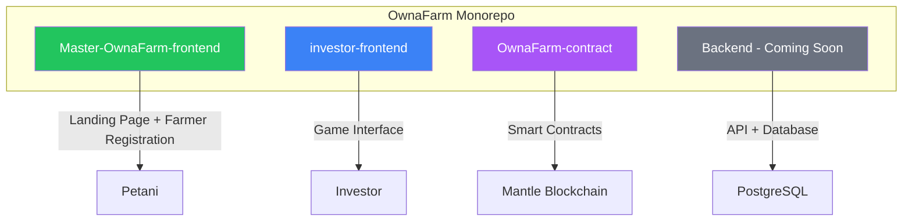
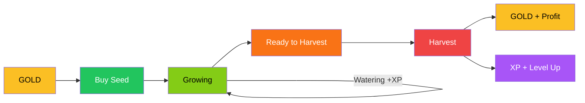
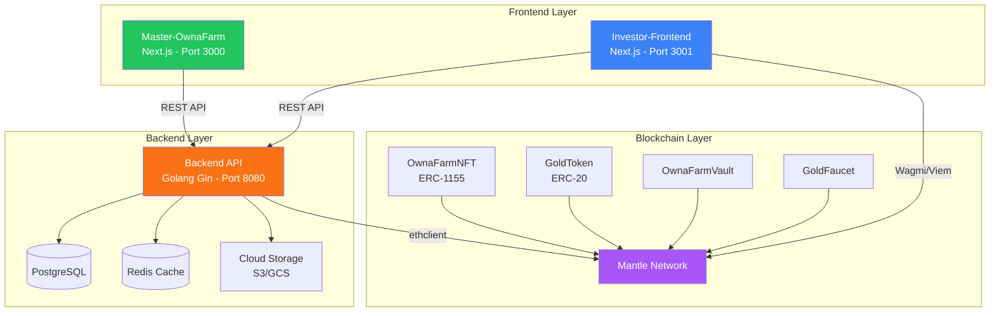
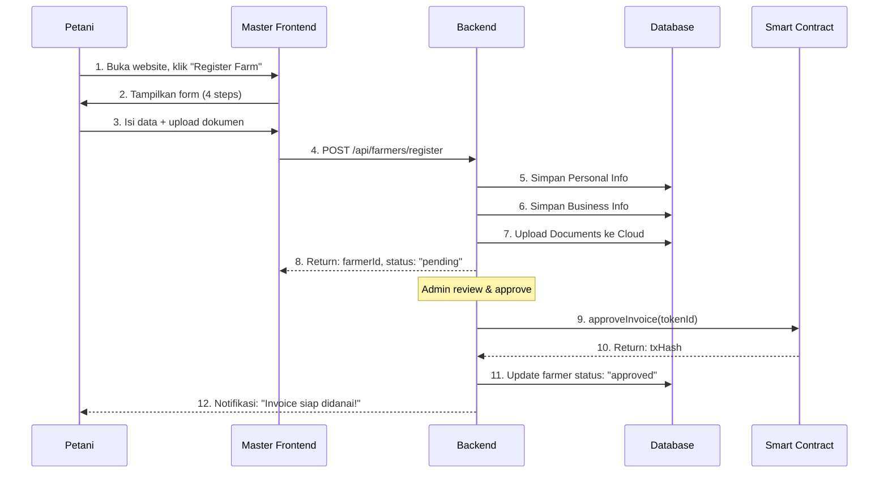
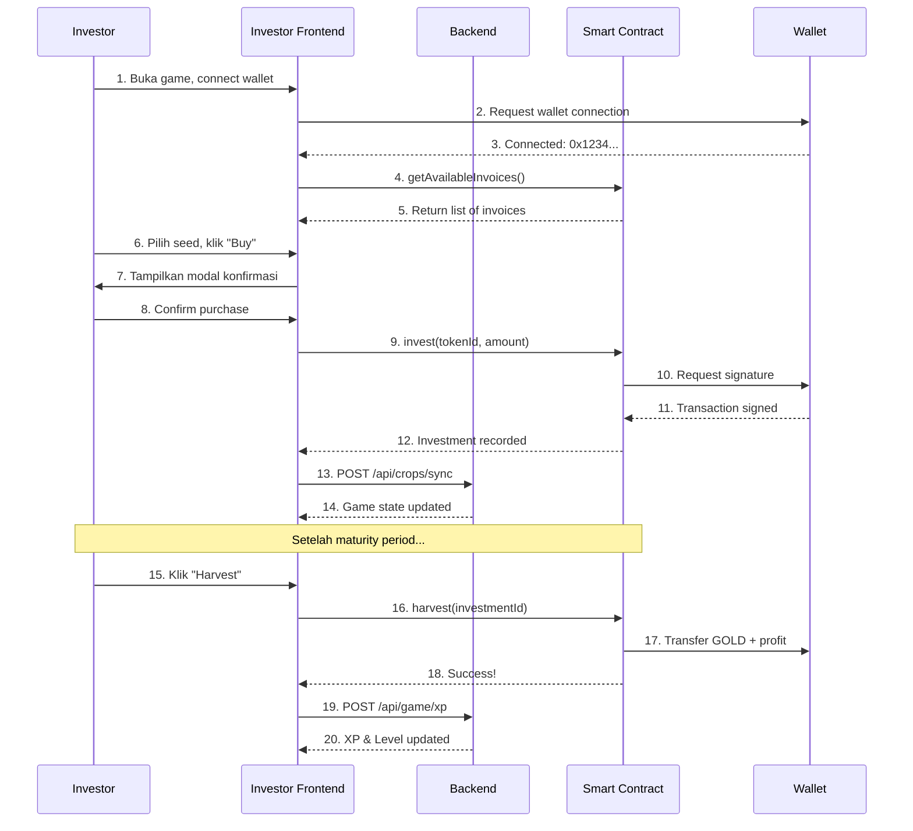
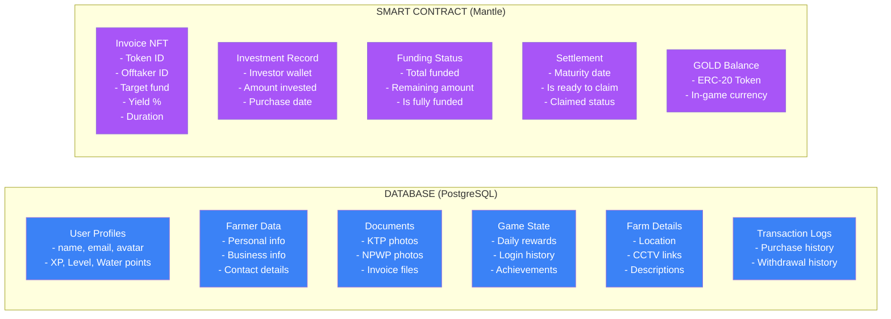
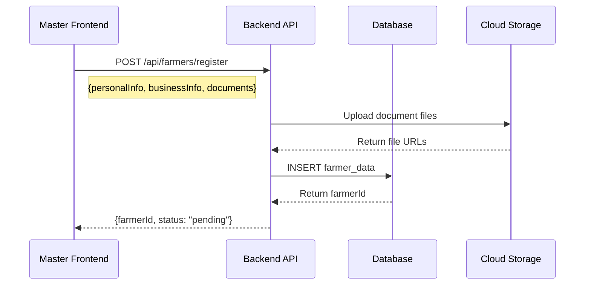
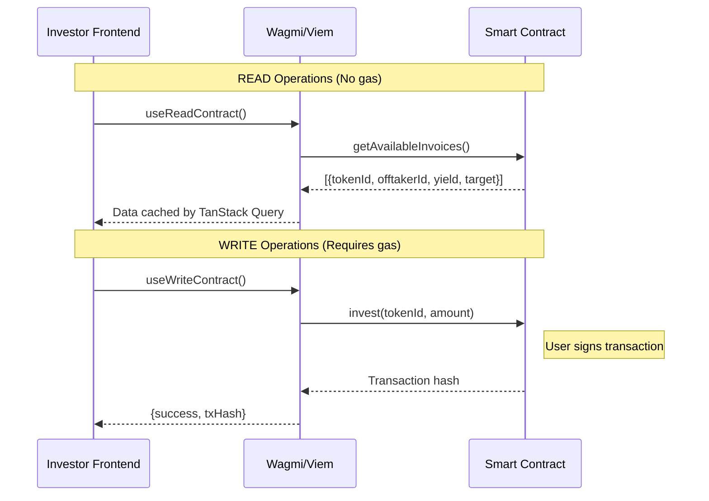
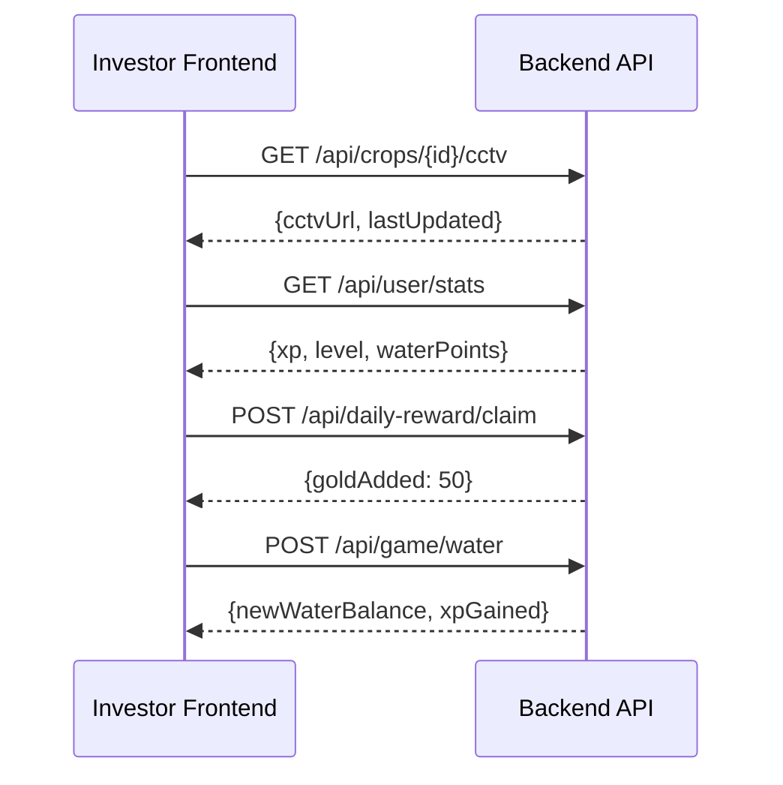

# OwnaFarm - Overview Project

> **Blockchain**: Mantle Network (L2 Ethereum)  
> **Docs**: https://docs.mantle.xyz/network  

---

## Apa itu OwnaFarm?

**OwnaFarm** adalah platform yang menghubungkan **Petani** dengan **Investor** menggunakan teknologi blockchain. 

Bayangkan seperti ini:
- **Petani** butuh modal untuk menanam → mendaftarkan invoice/kebunnya ke platform
- **Investor** punya uang → membeli "bibit virtual" yang merepresentasikan invoice petani
- Ketika tanaman panen → Investor mendapat keuntungan, Petani mendapat modal

**Konsep uniknya:** Investor tidak langsung melihat invoice yang ribet, tapi bermain "game pertanian" yang menyenangkan!

---

## Smart Contracts (Mantle Sepolia Testnet)

| Contract | Address |
|----------|---------|
| GoldToken | `0x787c8616d9b8Ccdca3B2b930183813828291dA9c` |
| GoldFaucet | `0x5644F393a2480BE5E63731C30fCa81F9e80277a7` |
| OwnaFarmNFT | `0xC51601dde25775bA2740EE14D633FA54e12Ef6C7` |
| OwnaFarmVault | `0x3b561Df673F08A566A09fEd718f5bdB8018C2CDa` |

> Detail function dan cara penggunaan: [Smart Contract README](https://github.com/OwnaFarm/OwnaFarm-contract/blob/main/README.md)

---

## Struktur Project



---

## Penjelasan Setiap Komponen

### 1. Master-OwnaFarm-Frontend (Untuk Petani)

**Fungsi Utama:**
- Landing page utama OwnaFarm (halaman marketing)
- Tempat petani mendaftarkan kebun/invoice mereka

**Halaman yang ada:**
| Halaman | Fungsi |
|---------|--------|
| `/` | Landing page dengan Hero, About, How It Works, Features, Partners |
| `/register-farm` | Form pendaftaran petani (multi-step form) |

**Data yang dikumpulkan dari Petani:**

```mermaid
flowchart LR
    subgraph Step1["Step 1: Personal Info"]
        A1[fullName]
        A2[email]
        A3[phoneNumber]
        A4[idNumber/KTP]
        A5[dateOfBirth]
        A6[address]
        A7[province]
        A8[city]
        A9[district]
        A10[postalCode]
    end
    
    subgraph Step2["Step 2: Business Info"]
        B1[businessName]
        B2[businessType]
        B3[npwp]
        B4[bankName]
        B5[bankAccountNumber]
        B6[bankAccountName]
        B7[yearsOfExperience]
        B8[cropsExpertise]
    end
    
    subgraph Step3["Step 3: Documents"]
        C1[ktpPhoto]
        C2[selfieWithKtp]
        C3[npwpPhoto]
        C4[bankStatement]
        C5[landCertificate]
        C6[businessLicense]
        C7[invoiceFile - COMING SOON]
    end
    
    subgraph Step4["Step 4: Review"]
        D1[Review All Data]
        D2[Submit]
    end
    
    Step1 --> Step2 --> Step3 --> Step4
```



---

### 2. Investor-Frontend (Untuk Investor/Gamers)

**Konsep:** Aplikasi game farming seperti "Hay Day" tapi untuk investasi nyata!

**Halaman yang ada:**
| Halaman | Fungsi |
|---------|--------|
| `/` | Homepage - Menampilkan tanaman aktif, daily reward |
| `/shop` | Marketplace - Beli "bibit" (= investasi ke invoice) |
| `/farm` | My Farm - Lihat semua tanaman milik investor |
| `/leaderboard` | Papan peringkat investor |
| `/profile` | Profil investor |

**Game Mechanics:**



**Data User (Investor):**
```typescript
interface UserProfile {
  name: string        // Nama user
  avatar: string      // Avatar emoji
  wallet: string      // Wallet address
  level: number       // Level game
  xp: number          // Experience points
  gold: number        // GOLD token (in-game currency)
  water: number       // Water points untuk siram tanaman
}
```

**Data Crop (Tanaman/Investasi):**
```typescript
interface Crop {
  id: string
  name: string            // Nama tanaman (contoh: "Cabai Indofood")
  image: string           // Gambar tanaman
  cctvImage: string       // Gambar CCTV kebun asli
  location: string        // Lokasi kebun
  progress: number        // Progress pertumbuhan (0-100%)
  daysLeft: number        // Sisa hari sampai panen
  yieldPercent: number    // Return yang dijanjikan (contoh: 18%)
  invested: number        // Jumlah GOLD yang diinvestasikan
  status: "growing" | "ready" | "harvested"
  plantedAt: Date         // Tanggal tanam/investasi
}
```

---

## Arsitektur Sistem

### Overview Arsitektur Lengkap



---

## Alur Lengkap Sistem

### Alur Petani (Farmer Flow)



### Alur Investor (Investor Flow)



---

## Pembagian Data: Database vs Smart Contract



---

## API Communication Diagram

### Master-OwnaFarm ↔ Backend



### Investor-Frontend ↔ Smart Contract



### Investor-Frontend ↔ Backend



---

**Created by:** OwnaFarm Team  
**Last Updated:** 2026-01-10  
**Version:** 2.0.0 (Smart Contracts Deployed)
