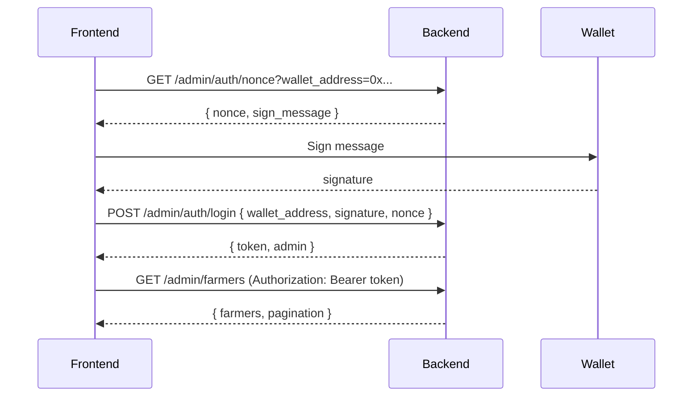

# Admin API Documentation

Dokumentasi API khusus untuk admin OwnaFarm (autentikasi wallet signature + manajemen farmer).

## 1. Admin Authentication

Admin menggunakan **wallet signature** untuk autentikasi.

Flow: Request nonce → Sign dengan wallet → Login dengan signature → Akses endpoints dengan JWT token.



**Catatan penting:**
- Nonce hanya bisa dipakai sekali, expired 5 menit.
- Rate limit: 5 attempts per 15 menit.
- JWT token digunakan untuk akses endpoint yang diproteksi.

### 1.1 Get Admin Nonce

| Method | Endpoint | Auth |
|--------|----------|------|
| `GET` | `/admin/auth/nonce` | ❌ |

**Query Parameters:**
- `wallet_address` (required) - Wallet address admin (format `0x...`).

**Response (200):**
```json
{
  "nonce": "a1b2c3d4e5f6789012345678",
  "sign_message": "Sign this message to login to OwnaFarm Admin.\n\nNonce: a1b2c3d4e5f6789012345678"
}
```

**Errors:**
- `400` - Invalid wallet
- `500` - Failed to generate nonce

### 1.2 Admin Login

Login admin dengan wallet signature.

| Method | Endpoint | Auth |
|--------|----------|------|
| `POST` | `/admin/auth/login` | ❌ |

**Request Body:**
```json
{
  "wallet_address": "0x742d35Cc6634C0532925a3b844Bc9e7595f0bEb",
  "signature": "0x1234567890abcdef...",
  "nonce": "a1b2c3d4e5f6789012345678"
}
```

**Field Details:**

| Field | Type | Required | Description |
|-------|------|----------|-------------|
| `wallet_address` | string | ✅ | Wallet address admin (format `0x...`). |
| `signature` | string | ✅ | Signature hasil sign `sign_message`. |
| `nonce` | string | ✅ | Nonce dari endpoint nonce (one-time use). |

**Response (200):**
```json
{
  "token": "eyJhbGciOiJIUzI1NiIsInR5cCI6IkpXVCJ9...",
  "admin": {
    "id": "uuid",
    "wallet_address": "0x742d35cc6634c0532925a3b844bc9e7595f0beb",
    "role": "admin"
  }
}
```

**Admin Roles (sementara):** `admin`

**Errors:**
- `400` - Invalid request body
- `401` - Invalid signature/nonce, admin not found, atau account inactive (includes `remaining_attempts`)
- `429` - Rate limit exceeded (includes `retry_after_seconds`)
- `500` - Internal server error

## 2. Farmer Management

### 2.1 Get Farmers List

Mendapatkan list farmers dengan filtering, pagination, dan sorting.

| Method | Endpoint | Auth |
|--------|----------|------|
| `GET` | `/admin/farmers` | ✅ Admin |

**Header Required:** `Authorization: Bearer {token}`

**Query Parameters:**

| Parameter | Type | Required | Default | Description |
|-----------|------|----------|---------|-------------|
| `status` | array | ❌ | all | Filter status (bisa multiple): `pending`, `under_review`, `approved`, `rejected`, `suspended`. |
| `page` | int | ❌ | 1 | Page number. |
| `limit` | int | ❌ | 10 | Items per page (max 100). |
| `sort_by` | string | ❌ | `created_at` | Field sorting: `created_at`, `full_name`, `status`. |
| `sort_order` | string | ❌ | `desc` | Urutan sorting: `asc`, `desc`. |
| `search` | string | ❌ | - | Search di name, email, phone. |

**Farmer Status Values:**

| Status | Description |
|--------|-------------|
| `pending` | Menunggu review admin |
| `under_review` | Sedang dalam proses review |
| `approved` | Disetujui, farmer aktif |
| `rejected` | Ditolak, perlu perbaikan |
| `suspended` | Dinonaktifkan sementara |

**Example:**
```bash
GET /admin/farmers?status=pending&status=under_review&page=1&limit=20
Authorization: Bearer {token}
```

**Response (200):**
```json
{
  "status": "success",
  "data": {
    "farmers": [
      {
        "id": "uuid",
        "status": "pending",
        "full_name": "Budi Santoso",
        "email": "budi@example.com",
        "phone_number": "+628123456789",
        "business_name": "Tani Makmur",
        "business_type": "cv",
        "province": "Jawa Barat",
        "city": "Bandung",
        "years_of_experience": 10,
        "created_at": "2024-01-15T10:30:00Z",
        "reviewed_at": null
      }
    ],
    "pagination": {
      "page": 1,
      "limit": 10,
      "total_items": 42,
      "total_pages": 5
    }
  }
}
```

**Errors:**
- `400` - Invalid query
- `401` - Unauthorized
- `500` - Internal server error

### 2.2 Approve Farmer

Approve farmer yang statusnya `pending`. Status akan berubah menjadi `approved`.

| Method | Endpoint | Auth |
|--------|----------|------|
| `PATCH` | `/admin/farmers/:id/approve` | ✅ Admin |

**Header Required:** `Authorization: Bearer {token}`

**URL Parameters:**
- `id` (required) - Farmer ID (UUID).

**Request Body:** Tidak diperlukan.

**Example:**
```bash
PATCH /admin/farmers/550e8400-e29b-41d4-a716-446655440000/approve
Authorization: Bearer {token}
```

**Response (200):**
```json
{
  "status": "success",
  "data": {
    "farmer_id": "550e8400-e29b-41d4-a716-446655440000",
    "status": "approved",
    "reviewed_by": "admin-uuid",
    "reviewed_at": "2024-01-15T14:30:00Z"
  }
}
```

**Errors:**
- `400` - Farmer ID is required
- `401` - Unauthorized
- `404` - Farmer not found
- `409` - Farmer has already been processed (not in pending status)
- `500` - Internal server error

### 2.3 Reject Farmer

Reject farmer yang statusnya `pending`. Status akan berubah menjadi `rejected`. Status ini bersifat final dan tidak dapat diubah.

| Method | Endpoint | Auth |
|--------|----------|------|
| `PATCH` | `/admin/farmers/:id/reject` | ✅ Admin |

**Header Required:** `Authorization: Bearer {token}`

**URL Parameters:**
- `id` (required) - Farmer ID (UUID).

**Request Body:**
```json
{
  "reason": "Dokumen tidak lengkap, mohon upload ulang KTP yang jelas."
}
```

**Field Details:**

| Field | Type | Required | Description |
|-------|------|----------|-------------|
| `reason` | string | ❌ | Alasan penolakan (max 500 karakter). |

**Example:**
```bash
PATCH /admin/farmers/550e8400-e29b-41d4-a716-446655440000/reject
Authorization: Bearer {token}
Content-Type: application/json

{
  "reason": "Dokumen tidak lengkap"
}
```

**Response (200):**
```json
{
  "status": "success",
  "data": {
    "farmer_id": "550e8400-e29b-41d4-a716-446655440000",
    "status": "rejected",
    "reviewed_by": "admin-uuid",
    "reviewed_at": "2024-01-15T14:30:00Z",
    "reason": "Dokumen tidak lengkap"
  }
}
```

**Errors:**
- `400` - Farmer ID is required
- `401` - Unauthorized
- `404` - Farmer not found
- `409` - Farmer has already been processed (not in pending status)
- `500` - Internal server error