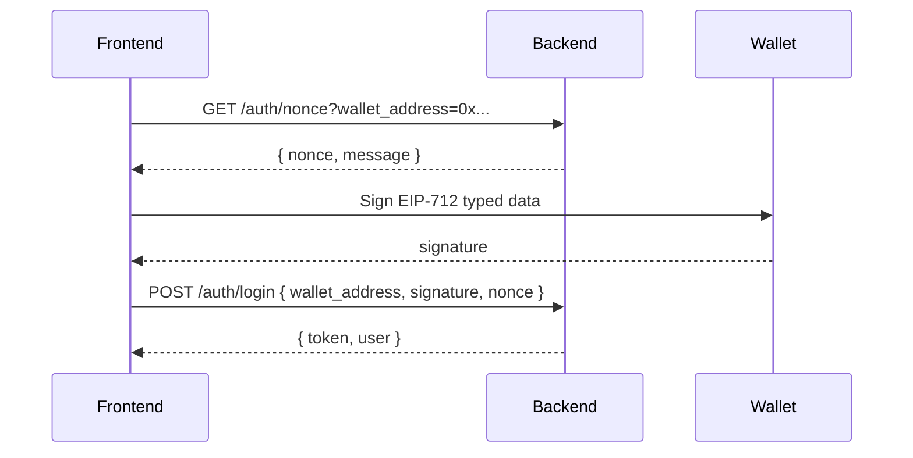

# Authentication API

Autentikasi menggunakan **EIP-712 Typed Data Signature** dari wallet Ethereum.

---

## Flow Login



---

## 1. Get Nonce

Mendapatkan nonce untuk proses signing.

| Method | Endpoint | Auth |
|--------|----------|------|
| `GET` | `/v1/auth/nonce` | ❌ |

### Request

| Query Param | Type | Required | Description |
|-------------|------|----------|-------------|
| `wallet_address` | string | ✅ | Alamat wallet (format: `0x...`) |

### Response

```json
{
  "status": "success",
  "data": {
    "nonce": "abc123xyz",
    "message": "Sign this message to login to OwnaFarm: abc123xyz"
  }
}
```

---

## 2. Login dengan Signature

Verifikasi signature dan dapatkan JWT token.

| Method | Endpoint | Auth |
|--------|----------|------|
| `POST` | `/v1/auth/login` | ❌ |

### Request Body

```json
{
  "wallet_address": "0x742d35Cc6634C0532925a3b844BC9e7595f7CCCC",
  "signature": "0x...",
  "nonce": "abc123xyz"
}
```

### Response

```json
{
  "status": "success",
  "data": {
    "token": "eyJhbGciOiJIUzI1NiIs...",
    "user": {
      "id": 1,
      "wallet_address": "0x742d35Cc6634C0532925a3b844BC9e7595f7CCCC"
    }
  }
}
```

---

## Frontend Implementation

### EIP-712 Typed Data Structure

```javascript
const typedData = {
  types: {
    EIP712Domain: [
      { name: "name", type: "string" },
      { name: "version", type: "string" },
      { name: "chainId", type: "uint256" }
    ],
    Login: [
      { name: "message", type: "string" }
    ]
  },
  primaryType: "Login",
  domain: {
    name: "OwnaFarm",      // sesuaikan dengan config backend
    version: "1",
    chainId: 1             // sesuaikan dengan chain yang digunakan
  },
  message: {
    message: "<message dari response GET /auth/nonce>"
  }
};
```

### Signing dengan ethers.js

```javascript
const signature = await signer.signTypedData(
  typedData.domain,
  { Login: typedData.types.Login },
  typedData.message
);
```

### Signing dengan wagmi/viem

```javascript
import { signTypedData } from '@wagmi/core';

const signature = await signTypedData({
  domain: typedData.domain,
  types: { Login: typedData.types.Login },
  primaryType: 'Login',
  message: typedData.message
});
```

---

## Error Responses

| Status | Message | Penyebab |
|--------|---------|----------|
| `400` | `wallet_address is required` | Query param tidak ada |
| `400` | `Invalid wallet address format` | Format alamat wallet salah |
| `400` | `Invalid request body` | Body JSON tidak valid |
| `401` | `Invalid or expired nonce` | Nonce tidak valid atau sudah digunakan |
| `401` | `Invalid signature` | Signature tidak cocok dengan wallet |
| `500` | `Failed to generate nonce` | Error server saat generate nonce |

---

## Catatan Penting

1. **Nonce hanya bisa digunakan sekali** - Request nonce baru jika login gagal
2. **Gunakan `message` dari response** - Jangan hardcode message, gunakan yang dari API
3. **Domain harus sama** - Pastikan `name`, `version`, dan `chainId` sama dengan backend
