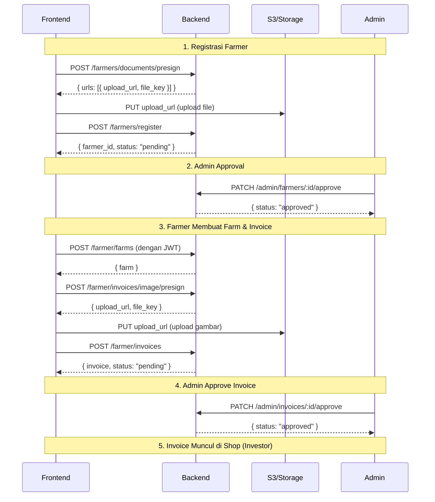

# Farmer API Documentation

API untuk registrasi petani (farmer) dan manajemen kebun (farm) serta invoice pendanaan.

**Base URL:** `/farmers` (public), `/farmer/auth` (public auth), dan `/farmer` (authenticated)

**Authentication:** Endpoint di `/farmer/*` (kecuali `/farmer/auth/*`) memerlukan JWT token dari farmer dengan status `approved`.

---

## Farmer Authentication

Farmer memiliki sistem autentikasi terpisah dari investor menggunakan wallet signature.

### Get Farmer Nonce

Mendapatkan nonce untuk ditandatangani oleh wallet farmer.

| Method | Endpoint | Auth |
|--------|----------|------|
| `GET` | `/farmer/auth/nonce` | ❌ |

**Query Parameters:**

| Parameter | Type | Required | Description |
|-----------|------|----------|-------------|
| `wallet_address` | string | ✅ | Wallet address farmer (0x...) |

**Response (200):**

```json
{
  "status": "success",
  "data": {
    "nonce": "a1b2c3d4e5f67890...",
    "message": "Sign this message to login to OwnaFarm as Farmer.\n\nNonce: a1b2c3d4e5f67890..."
  }
}
```

**Errors:**
- `400` - `wallet_address query parameter is required`
- `400` - `Invalid wallet address format`

---

### Farmer Login

Login farmer dengan wallet signature. Hanya farmer dengan status `approved` yang dapat login.

| Method | Endpoint | Auth |
|--------|----------|------|
| `POST` | `/farmer/auth/login` | ❌ |

**Request Body:**

```json
{
  "wallet_address": "0x742d35Cc6634C0532925a3b844BC9e7595f7CCCC",
  "signature": "0x1234567890abcdef...",
  "nonce": "a1b2c3d4e5f67890..."
}
```

**Response (200):**

```json
{
  "status": "success",
  "data": {
    "token": "eyJhbGciOiJIUzI1NiIsInR5cCI6IkpXVCJ9...",
    "farmer": {
      "id": "f1a2b3c4-d5e6-7890-abcd-ef1234567890",
      "wallet_address": "0x742d35cc6634c0532925a3b844bc9e7595f7cccc",
      "full_name": "Budi Santoso",
      "email": "budi.santoso@example.com"
    }
  }
}
```

**Errors:**
- `400` - `Invalid request body`
- `400` - `Invalid wallet address format`
- `401` - `Invalid or expired nonce`
- `401` - `Invalid signature`
- `401` - `Farmer account not found. Please register first.`
- `403` - `Farmer account is not approved` (includes `current_status` in response)

---

### Get Current Farmer

Mendapatkan data farmer yang sedang login.

| Method | Endpoint | Auth |
|--------|----------|------|
| `GET` | `/farmer/me` | ✅ Farmer |

**Response (200):**

```json
{
  "status": "success",
  "data": {
    "id": "f1a2b3c4-d5e6-7890-abcd-ef1234567890",
    "status": "approved",
    "wallet_address": "0x742d35cc6634c0532925a3b844bc9e7595f7cccc",
    "full_name": "Budi Santoso",
    "email": "budi.santoso@example.com",
    "phone_number": "+628123456789",
    "id_number": "3201234567890123",
    "date_of_birth": "1985-06-15T00:00:00Z",
    "address": "Jl. Merdeka No. 123",
    "province": "Jawa Barat",
    "city": "Bandung",
    "district": "Coblong",
    "postal_code": "40132",
    "business_name": "Tani Makmur",
    "business_type": "cv",
    "npwp": "12.345.678.9-123.000",
    "bank_name": "Bank BCA",
    "bank_account_number": "1234567890",
    "bank_account_name": "Budi Santoso",
    "years_of_experience": 10,
    "crops_expertise": ["padi", "jagung", "cabai"],
    "reviewed_by": "admin-uuid",
    "reviewed_at": "2024-01-16T09:00:00Z",
    "created_at": "2024-01-15T10:30:00Z",
    "updated_at": "2024-01-16T09:00:00Z"
  }
}
```

**Errors:**
- `401` - `Farmer not authenticated`
- `404` - `Farmer not found`

---

## Flow Lengkap Farmer



---

## Part 1: Farmer Registration (Public)

### 1.1 Get Presigned URLs

Mendapatkan presigned URLs untuk upload dokumen.

| Method | Endpoint | Auth |
|--------|----------|------|
| `POST` | `/farmers/documents/presign` | ❌ |

### Request Body

```json
{
  "document_types": [
    "ktp_photo",
    "selfie_with_ktp",
    "npwp_photo",
    "bank_statement",
    "land_certificate"
  ]
}
```

#### Document Types

| Type | Description | Required |
|------|-------------|----------|
| `ktp_photo` | Foto KTP | ✅ |
| `selfie_with_ktp` | Foto Selfie dengan KTP | ✅ |
| `npwp_photo` | Foto NPWP | ❌ |
| `bank_statement` | Foto/PDF Rekening Koran | ❌ |
| `land_certificate` | Sertifikat Lahan | ❌ |
| `business_license` | SIUP/Izin Usaha | ❌ |
| `invoice_file` | Invoice/Nota | ❌ |

### Response

```json
{
  "status": "success",
  "data": {
    "urls": [
      {
        "document_type": "ktp_photo",
        "upload_url": "https://s3.amazonaws.com/bucket/path?signature=...",
        "file_key": "farmers/documents/uuid-ktp.jpg"
      },
      {
        "document_type": "selfie_with_ktp",
        "upload_url": "https://s3.amazonaws.com/bucket/path?signature=...",
        "file_key": "farmers/documents/uuid-selfie.jpg"
      }
    ]
  }
}
```

### Upload File ke Storage

Gunakan presigned URL untuk upload file:

```javascript
// Upload menggunakan fetch
const file = document.getElementById('fileInput').files[0];
const uploadUrl = presignedResponse.data.urls[0].upload_url;

const response = await fetch(uploadUrl, {
  method: 'PUT',
  body: file,
  headers: {
    'Content-Type': file.type
  }
});

if (response.ok) {
  console.log('File uploaded successfully');
}
```

---

### 1.2 Register Farmer

Mendaftarkan petani baru dengan data lengkap dan dokumen yang sudah diupload.

| Method | Endpoint | Auth |
|--------|----------|------|
| `POST` | `/farmers/register` | ❌ |

### Request Body

```json
{
  "personal_info": {
    "full_name": "Budi Santoso",
    "email": "budi.santoso@example.com",
    "phone_number": "+628123456789",
    "id_number": "3201234567890123",
    "date_of_birth": "1985-06-15",
    "address": "Jl. Merdeka No. 123",
    "province": "Jawa Barat",
    "city": "Bandung",
    "district": "Coblong",
    "postal_code": "40132",
    "wallet_address": "0x742d35Cc6634C0532925a3b844BC9e7595f7CCCC"
  },
  "business_info": {
    "business_name": "Tani Makmur",
    "business_type": "cv",
    "npwp": "12.345.678.9-123.000",
    "bank_name": "Bank BCA",
    "bank_account_number": "1234567890",
    "bank_account_name": "Budi Santoso",
    "years_of_experience": 10,
    "crops_expertise": ["padi", "jagung", "cabai"]
  },
  "documents": [
    {
      "document_type": "ktp_photo",
      "file_key": "farmers/documents/uuid-ktp.jpg",
      "file_name": "ktp-budi.jpg",
      "file_size": 245678,
      "mime_type": "image/jpeg"
    },
    {
      "document_type": "selfie_with_ktp",
      "file_key": "farmers/documents/uuid-selfie.jpg",
      "file_name": "selfie-budi.jpg",
      "file_size": 189234,
      "mime_type": "image/jpeg"
    }
  ]
}
```

#### Field Details

**Personal Info (Required)**

| Field | Type | Required | Validation | Description |
|-------|------|----------|------------|-------------|
| `full_name` | string | ✅ | max 100 char | Nama lengkap sesuai KTP |
| `email` | string | ✅ | valid email, max 255 | Email yang valid |
| `phone_number` | string | ✅ | max 20 char | Nomor telepon aktif |
| `id_number` | string | ✅ | max 20 char | Nomor KTP/NIK |
| `date_of_birth` | string | ✅ | YYYY-MM-DD | Tanggal lahir |
| `address` | string | ✅ | - | Alamat lengkap |
| `province` | string | ✅ | max 100 char | Provinsi |
| `city` | string | ✅ | max 100 char | Kota/Kabupaten |
| `district` | string | ✅ | max 100 char | Kecamatan |
| `postal_code` | string | ✅ | max 10 char | Kode pos |
| `wallet_address` | string | ✅ | exactly 42 char, starts with 0x | Ethereum wallet address untuk login via signature |

**Business Info (Required)**

| Field | Type | Required | Validation | Description |
|-------|------|----------|------------|-------------|
| `business_name` | string | ❌ | max 200 char | Nama usaha (optional) |
| `business_type` | string | ✅ | enum | Jenis usaha: `individual`, `cv`, `pt`, `ud`, `cooperative` |
| `npwp` | string | ❌ | max 30 char | Nomor NPWP (optional) |
| `bank_name` | string | ✅ | max 100 char | Nama bank |
| `bank_account_number` | string | ✅ | max 30 char | Nomor rekening |
| `bank_account_name` | string | ✅ | max 100 char | Nama pemilik rekening |
| `years_of_experience` | int | ❌ | - | Tahun pengalaman bertani |
| `crops_expertise` | array | ❌ | - | List komoditas yang dikuasai |

**Documents (Required, min 1)**

| Field | Type | Required | Description |
|-------|------|----------|-------------|
| `document_type` | string | ✅ | Jenis dokumen (lihat tabel Document Types) |
| `file_key` | string | ✅ | File key dari presigned URL response |
| `file_name` | string | ❌ | Nama file original |
| `file_size` | int | ❌ | Ukuran file dalam bytes |
| `mime_type` | string | ❌ | MIME type file |

### Response

**Success (201 Created)**

```json
{
  "status": "success",
  "data": {
    "farmer_id": "f1a2b3c4-d5e6-7890-abcd-ef1234567890",
    "status": "pending"
  }
}
```

#### Farmer Status

| Status | Description |
|--------|-------------|
| `pending` | Menunggu review admin |
| `under_review` | Sedang dalam proses review |
| `approved` | Disetujui, farmer aktif |
| `rejected` | Ditolak, perlu perbaikan |
| `suspended` | Ditangguhkan sementara |

---

## Part 2: Farm Management (Authenticated Farmer)

> **Note:** Semua endpoint di bagian ini memerlukan JWT token dari user dengan farmer profile yang sudah `approved`.

**Header Required:** `Authorization: Bearer {token}`

### 2.1 Create Farm

Membuat kebun baru.

| Method | Endpoint | Auth |
|--------|----------|------|
| `POST` | `/farmer/farms` | ✅ Farmer |

**Request Body:**

```json
{
  "name": "Kebun Cabai Ciwidey",
  "description": "Kebun cabai rawit merah seluas 2 hektar di dataran tinggi Ciwidey",
  "location": "Ciwidey, Bandung, Jawa Barat",
  "latitude": -7.1234567,
  "longitude": 107.4567890,
  "land_area": 2.5
}
```

**Field Details:**

| Field | Type | Required | Validation | Description |
|-------|------|----------|------------|-------------|
| `name` | string | ✅ | max 200 char | Nama kebun |
| `description` | string | ❌ | - | Deskripsi kebun |
| `location` | string | ✅ | max 255 char | Alamat/lokasi kebun |
| `latitude` | float | ❌ | -90 to 90 | Koordinat latitude |
| `longitude` | float | ❌ | -180 to 180 | Koordinat longitude |
| `land_area` | float | ❌ | min 0 | Luas lahan dalam hektar |

**Response (201 Created):**

```json
{
  "status": "success",
  "data": {
    "farm": {
      "id": "a1b2c3d4-e5f6-7890-abcd-ef1234567890",
      "farmer_id": "f1a2b3c4-d5e6-7890-abcd-ef1234567890",
      "name": "Kebun Cabai Ciwidey",
      "description": "Kebun cabai rawit merah seluas 2 hektar di dataran tinggi Ciwidey",
      "location": "Ciwidey, Bandung, Jawa Barat",
      "latitude": -7.1234567,
      "longitude": 107.4567890,
      "land_area": 2.5,
      "cctv_url": null,
      "cctv_image_url": null,
      "cctv_last_updated": null,
      "is_active": true,
      "created_at": "2024-01-15T10:30:00Z",
      "updated_at": "2024-01-15T10:30:00Z"
    }
  }
}
```

**Errors:**
- `400` - Invalid request body
- `401` - Unauthorized
- `403` - Farmer not approved
- `500` - Internal server error

---

### 2.2 List My Farms

Mendapatkan list kebun milik farmer yang sedang login.

| Method | Endpoint | Auth |
|--------|----------|------|
| `GET` | `/farmer/farms` | ✅ Farmer |

**Query Parameters:**

| Parameter | Type | Required | Default | Description |
|-----------|------|----------|---------|-------------|
| `is_active` | bool | ❌ | all | Filter berdasarkan status aktif |
| `page` | int | ❌ | 1 | Page number |
| `limit` | int | ❌ | 10 | Items per page (max 100) |
| `sort_by` | string | ❌ | `created_at` | Field sorting: `created_at`, `name`, `location`, `land_area` |
| `sort_order` | string | ❌ | `desc` | Urutan: `asc`, `desc` |
| `search` | string | ❌ | - | Search di name, location |

**Example:**
```bash
GET /farmer/farms?is_active=true&page=1&limit=10
Authorization: Bearer {token}
```

**Response (200):**

```json
{
  "status": "success",
  "data": {
    "farms": [
      {
        "id": "a1b2c3d4-e5f6-7890-abcd-ef1234567890",
        "name": "Kebun Cabai Ciwidey",
        "location": "Ciwidey, Bandung, Jawa Barat",
        "land_area": 2.5,
        "is_active": true,
        "created_at": "2024-01-15T10:30:00Z"
      }
    ],
    "pagination": {
      "page": 1,
      "limit": 10,
      "total_items": 3,
      "total_pages": 1
    }
  }
}
```

---

### 2.3 Get Farm Detail

Mendapatkan detail kebun berdasarkan ID.

| Method | Endpoint | Auth |
|--------|----------|------|
| `GET` | `/farmer/farms/:id` | ✅ Farmer |

**URL Parameters:**
- `id` (required) - Farm ID (UUID)

**Response (200):**

```json
{
  "status": "success",
  "data": {
    "farm": {
      "id": "a1b2c3d4-e5f6-7890-abcd-ef1234567890",
      "farmer_id": "f1a2b3c4-d5e6-7890-abcd-ef1234567890",
      "name": "Kebun Cabai Ciwidey",
      "description": "Kebun cabai rawit merah seluas 2 hektar",
      "location": "Ciwidey, Bandung, Jawa Barat",
      "latitude": -7.1234567,
      "longitude": 107.4567890,
      "land_area": 2.5,
      "cctv_url": "rtsp://camera.example.com/stream",
      "cctv_image_url": "https://storage.example.com/cctv/snapshot.jpg",
      "cctv_last_updated": "2024-01-15T14:00:00Z",
      "is_active": true,
      "created_at": "2024-01-15T10:30:00Z",
      "updated_at": "2024-01-15T14:00:00Z"
    }
  }
}
```

**Errors:**
- `401` - Unauthorized
- `404` - Farm not found

---

### 2.4 Update Farm

Mengupdate data kebun.

| Method | Endpoint | Auth |
|--------|----------|------|
| `PUT` | `/farmer/farms/:id` | ✅ Farmer |

**URL Parameters:**
- `id` (required) - Farm ID (UUID)

**Request Body (semua field optional):**

```json
{
  "name": "Kebun Cabai Ciwidey Updated",
  "description": "Deskripsi baru",
  "location": "Lokasi baru",
  "latitude": -7.1234567,
  "longitude": 107.4567890,
  "land_area": 3.0,
  "cctv_url": "rtsp://camera.example.com/stream",
  "cctv_image_url": "https://storage.example.com/cctv/snapshot.jpg"
}
```

**Response (200):**

```json
{
  "status": "success",
  "data": {
    "farm": {
      "id": "a1b2c3d4-e5f6-7890-abcd-ef1234567890",
      "name": "Kebun Cabai Ciwidey Updated",
      "..."
    }
  }
}
```

**Errors:**
- `400` - Invalid request body
- `401` - Unauthorized
- `404` - Farm not found

---

### 2.5 Delete Farm (Soft Delete)

Menonaktifkan kebun (soft delete - set `is_active = false`).

| Method | Endpoint | Auth |
|--------|----------|------|
| `DELETE` | `/farmer/farms/:id` | ✅ Farmer |

**URL Parameters:**
- `id` (required) - Farm ID (UUID)

**Response (200):**

```json
{
  "status": "success",
  "message": "Farm deleted successfully"
}
```

**Errors:**
- `401` - Unauthorized
- `404` - Farm not found

---

## Part 3: Invoice Management (Authenticated Farmer)

Invoice adalah pengajuan proyek pendanaan yang akan menjadi "NFT" atau "Bibit" bagi investor setelah di-approve admin.

### 3.1 Get Presigned URL for Invoice Image

Mendapatkan presigned URL untuk upload gambar invoice/tanaman.

| Method | Endpoint | Auth |
|--------|----------|------|
| `POST` | `/farmer/invoices/image/presign` | ✅ Farmer |

**Request Body:**

```json
{
  "file_name": "cabai-rawit.jpg",
  "content_type": "image/jpeg"
}
```

**Field Details:**

| Field | Type | Required | Validation | Description |
|-------|------|----------|------------|-------------|
| `file_name` | string | ✅ | - | Nama file gambar |
| `content_type` | string | ✅ | enum | MIME type: `image/jpeg`, `image/png`, `image/webp` |

**Response (200):**

```json
{
  "status": "success",
  "data": {
    "upload_url": "https://s3.amazonaws.com/bucket/invoices/images/uuid-cabai.jpg?signature=...",
    "file_key": "invoices/images/uuid-cabai-rawit.jpg"
  }
}
```

---

### 3.2 Create Invoice

Membuat invoice/pengajuan proyek pendanaan baru.

| Method | Endpoint | Auth |
|--------|----------|------|
| `POST` | `/farmer/invoices` | ✅ Farmer |

**Request Body:**

```json
{
  "farm_id": "a1b2c3d4-e5f6-7890-abcd-ef1234567890",
  "name": "Cabai Rawit Merah - Batch 1",
  "description": "Proyek penanaman cabai rawit merah untuk kebutuhan Indofood. Target panen 3 bulan.",
  "image_key": "invoices/images/uuid-cabai-rawit.jpg",
  "target_fund": 50000000,
  "yield_percent": 18.5,
  "duration_days": 90,
  "offtaker_id": "indofood-001",
  "token_id": 12345,
  "tx_hash": "0xabc123def456789012345678901234567890123456789012345678901234abcd"
}
```

**Field Details:**

| Field | Type | Required | Validation | Description |
|-------|------|----------|------------|-------------|
| `farm_id` | string | ✅ | UUID | ID kebun yang akan digunakan |
| `name` | string | ✅ | max 200 char | Nama proyek/tanaman (misal: "Cabai Indofood") |
| `description` | string | ❌ | - | Deskripsi proyek |
| `image_key` | string | ❌ | - | File key dari presigned upload (gambar tanaman untuk game) |
| `target_fund` | float | ✅ | > 0 | Target pendanaan dalam GOLD |
| `yield_percent` | float | ✅ | > 0, max 100 | Persentase return (misal: 18.5%) |
| `duration_days` | int | ✅ | min 1 | Durasi sampai panen/maturity dalam hari |
| `offtaker_id` | string | ❌ | max 100 char | ID offtaker/pembeli (optional) |
| `token_id` | int | ❌ | - | Token ID dari smart contract event `InvoiceSubmitted` |
| `tx_hash` | string | ❌ | - | Transaction hash dari transaksi `submitInvoice` |

**Response (201 Created):**

```json
{
  "status": "success",
  "data": {
    "invoice": {
      "id": "i1a2b3c4-d5e6-7890-abcd-ef1234567890",
      "farm_id": "a1b2c3d4-e5f6-7890-abcd-ef1234567890",
      "farm_name": "Kebun Cabai Ciwidey",
      "token_id": null,
      "offtaker_id": "indofood-001",
      "name": "Cabai Rawit Merah - Batch 1",
      "description": "Proyek penanaman cabai rawit merah untuk kebutuhan Indofood.",
      "image_url": "invoices/images/uuid-cabai-rawit.jpg",
      "target_fund": 50000000,
      "yield_percent": 18.5,
      "duration_days": 90,
      "total_funded": 0,
      "is_fully_funded": false,
      "status": "pending",
      "rejection_reason": null,
      "reviewed_by": null,
      "reviewed_at": null,
      "approved_at": null,
      "funding_deadline": null,
      "maturity_date": null,
      "approval_tx_hash": null,
      "created_at": "2024-01-15T10:30:00Z",
      "updated_at": "2024-01-15T10:30:00Z"
    }
  }
}
```

**Errors:**
- `400` - Invalid request body / Farm is not active
- `401` - Unauthorized
- `404` - Farm not found

---

### 3.3 List My Invoices

Mendapatkan list invoice milik farmer yang sedang login.

| Method | Endpoint | Auth |
|--------|----------|------|
| `GET` | `/farmer/invoices` | ✅ Farmer |

**Query Parameters:**

| Parameter | Type | Required | Default | Description |
|-----------|------|----------|---------|-------------|
| `farm_id` | string | ❌ | all | Filter berdasarkan farm ID |
| `status` | array | ❌ | all | Filter status: `pending`, `approved`, `rejected` |
| `page` | int | ❌ | 1 | Page number |
| `limit` | int | ❌ | 10 | Items per page (max 100) |
| `sort_by` | string | ❌ | `created_at` | Field sorting: `created_at`, `name`, `target_fund`, `status` |
| `sort_order` | string | ❌ | `desc` | Urutan: `asc`, `desc` |
| `search` | string | ❌ | - | Search di name |

**Example:**
```bash
GET /farmer/invoices?status=pending&status=approved&page=1&limit=10
Authorization: Bearer {token}
```

**Response (200):**

```json
{
  "status": "success",
  "data": {
    "invoices": [
      {
        "id": "i1a2b3c4-d5e6-7890-abcd-ef1234567890",
        "farm_id": "a1b2c3d4-e5f6-7890-abcd-ef1234567890",
        "farm_name": "Kebun Cabai Ciwidey",
        "name": "Cabai Rawit Merah - Batch 1",
        "image_url": "invoices/images/uuid-cabai-rawit.jpg",
        "target_fund": 50000000,
        "yield_percent": 18.5,
        "duration_days": 90,
        "total_funded": 0,
        "is_fully_funded": false,
        "status": "pending",
        "created_at": "2024-01-15T10:30:00Z"
      }
    ],
    "pagination": {
      "page": 1,
      "limit": 10,
      "total_items": 5,
      "total_pages": 1
    }
  }
}
```

---

### 3.4 Get Invoice Detail

Mendapatkan detail invoice berdasarkan ID.

| Method | Endpoint | Auth |
|--------|----------|------|
| `GET` | `/farmer/invoices/:id` | ✅ Farmer |

**URL Parameters:**
- `id` (required) - Invoice ID (UUID)

**Response (200):**

```json
{
  "status": "success",
  "data": {
    "invoice": {
      "id": "i1a2b3c4-d5e6-7890-abcd-ef1234567890",
      "farm_id": "a1b2c3d4-e5f6-7890-abcd-ef1234567890",
      "farm_name": "Kebun Cabai Ciwidey",
      "token_id": 12345,
      "offtaker_id": "indofood-001",
      "name": "Cabai Rawit Merah - Batch 1",
      "description": "Proyek penanaman cabai rawit merah",
      "image_url": "invoices/images/uuid-cabai-rawit.jpg",
      "target_fund": 50000000,
      "yield_percent": 18.5,
      "duration_days": 90,
      "total_funded": 25000000,
      "is_fully_funded": false,
      "status": "approved",
      "rejection_reason": null,
      "reviewed_by": "admin-uuid",
      "reviewed_at": "2024-01-16T09:00:00Z",
      "approved_at": "2024-01-16T09:00:00Z",
      "funding_deadline": "2024-02-16T09:00:00Z",
      "maturity_date": "2024-04-16T09:00:00Z",
      "approval_tx_hash": "0x1234567890abcdef...",
      "created_at": "2024-01-15T10:30:00Z",
      "updated_at": "2024-01-16T09:00:00Z"
    }
  }
}
```

**Errors:**
- `401` - Unauthorized
- `404` - Invoice not found

---

## Invoice Status

| Status | Description |
|--------|-------------|
| `pending` | Menunggu review admin |
| `approved` | Disetujui, akan muncul di Shop investor |
| `rejected` | Ditolak oleh admin |

---

## Error Responses

| Status | Message | Penyebab |
|--------|---------|----------|
| `400` | `Invalid request body` | Body JSON tidak valid atau field validation gagal |
| `400` | `Invalid query parameters` | Query parameter tidak valid |
| `400` | `Invalid date format for date_of_birth, expected YYYY-MM-DD` | Format tanggal salah |
| `400` | `Farm is not active` | Farm sudah di-soft delete |
| `401` | `Farmer not authenticated` | Token tidak valid atau tidak ada |
| `403` | `Farmer profile is not approved` | Farmer belum di-approve admin |
| `403` | `No farmer profile found for this user` | User belum memiliki farmer profile |
| `404` | `Farmer not found` | Farmer tidak ditemukan |
| `404` | `Farm not found` | Farm tidak ditemukan |
| `404` | `Invoice not found` | Invoice tidak ditemukan |
| `409` | `Farmer with this email or phone number already exists` | Email/phone sudah terdaftar |
| `409` | `Farmer with this wallet address already exists` | Wallet address sudah terdaftar |
| `500` | `Internal server error` | Error server |

---

## Frontend Implementation Example

### Complete Invoice Creation Flow

```javascript
// 1. Get presigned URL for image
async function getInvoiceImagePresignURL(fileName, contentType) {
  const response = await fetch('/farmer/invoices/image/presign', {
    method: 'POST',
    headers: {
      'Content-Type': 'application/json',
      'Authorization': `Bearer ${token}`
    },
    body: JSON.stringify({ file_name: fileName, content_type: contentType })
  });
  return response.json();
}

// 2. Upload image to storage
async function uploadImage(file, uploadUrl) {
  const response = await fetch(uploadUrl, {
    method: 'PUT',
    body: file,
    headers: { 'Content-Type': file.type }
  });
  return response.ok;
}

// 3. Create invoice
async function createInvoice(data) {
  const response = await fetch('/farmer/invoices', {
    method: 'POST',
    headers: {
      'Content-Type': 'application/json',
      'Authorization': `Bearer ${token}`
    },
    body: JSON.stringify(data)
  });
  return response.json();
}

// Complete flow
async function submitInvoice(formData, imageFile) {
  // Step 1: Get presigned URL
  const presignResponse = await getInvoiceImagePresignURL(
    imageFile.name,
    imageFile.type
  );
  
  // Step 2: Upload image
  const uploadSuccess = await uploadImage(
    imageFile,
    presignResponse.data.upload_url
  );
  
  if (!uploadSuccess) {
    throw new Error('Failed to upload image');
  }
  
  // Step 3: Create invoice with image_key
  const invoiceData = {
    ...formData,
    image_key: presignResponse.data.file_key
  };
  
  return await createInvoice(invoiceData);
}
```

### Complete Registration Flow

```javascript
// 1. Request presigned URLs
async function getPresignedURLs(documentTypes) {
  const response = await fetch('/farmers/documents/presign', {
    method: 'POST',
    headers: { 'Content-Type': 'application/json' },
    body: JSON.stringify({ document_types: documentTypes })
  });
  return response.json();
}

// 2. Upload files to storage
async function uploadFile(file, uploadUrl) {
  const response = await fetch(uploadUrl, {
    method: 'PUT',
    body: file,
    headers: { 'Content-Type': file.type }
  });
  return response.ok;
}

// 3. Register farmer
async function registerFarmer(data) {
  const response = await fetch('/farmers/register', {
    method: 'POST',
    headers: { 'Content-Type': 'application/json' },
    body: JSON.stringify(data)
  });
  return response.json();
}

// Complete flow
async function completeRegistration(formData, files) {
  // Step 1: Get presigned URLs
  const documentTypes = Object.keys(files); // e.g., ['ktp_photo', 'selfie_with_ktp']
  const presignResponse = await getPresignedURLs(documentTypes);
  
  // Step 2: Upload all files
  const documents = [];
  for (const urlData of presignResponse.data.urls) {
    const file = files[urlData.document_type];
    const uploadSuccess = await uploadFile(file, urlData.upload_url);
    
    if (!uploadSuccess) {
      throw new Error(`Failed to upload ${urlData.document_type}`);
    }
    
    // Save document info for registration
    documents.push({
      document_type: urlData.document_type,
      file_key: urlData.file_key,
      file_name: file.name,
      file_size: file.size,
      mime_type: file.type
    });
  }
  
  // Step 3: Register farmer with all data
  const registrationData = {
    personal_info: formData.personalInfo,
    business_info: formData.businessInfo,
    documents: documents
  };
  
  const registerResponse = await registerFarmer(registrationData);
  return registerResponse;
}
```

---

## Catatan Penting

1. **Upload File Langsung ke Storage** - File tidak melalui backend, gunakan presigned URL untuk upload langsung ke S3/Storage
2. **File Key adalah Identifier** - Simpan `file_key` dari presign response untuk digunakan saat registrasi
3. **9` | `Farmer with this email or phone number already exists` | Email atau nomor telepon sudah terdaftar |
| `500` | `Failed to register farmer` | Error server saat registrasi |
| `500` | `Failed to generate presigned URLs` | Error saat generate presigned URL