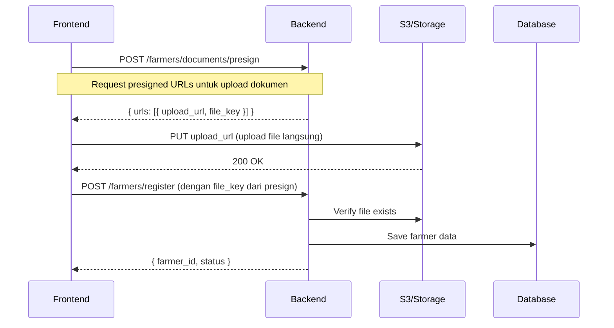

# Farmer Registration API

API untuk registrasi petani (farmer) dengan sistem upload dokumen menggunakan **Presigned URL**.

---

## Flow Registrasi Petani



### Penjelasan Flow

1. **Request Presigned URLs** - Frontend meminta presigned URL untuk setiap jenis dokumen yang akan diupload
2. **Upload ke Storage** - Frontend mengupload file langsung ke S3/Storage menggunakan presigned URL (PUT request)
3. **Register Farmer** - Setelah semua file terupload, frontend mengirim data registrasi beserta `file_key` dari setiap dokumen
4. **Backend Verification** - Backend memverifikasi file sudah ada di storage sebelum menyimpan data farmer

> **Note:** File diupload langsung ke storage (S3), tidak melalui backend. Backend hanya menggenerate presigned URL dan memverifikasi file setelah upload.

---

## 1. Get Presigned URLs

Mendapatkan presigned URLs untuk upload dokumen.

| Method | Endpoint | Auth |
|--------|----------|------|
| `POST` | `/farmers/documents/presign` | ❌ |

### Request Body

```json
{
  "document_types": [
    "ktp_photo",
    "selfie_with_ktp",
    "npwp_photo",
    "bank_statement",
    "land_certificate"
  ]
}
```

#### Document Types

| Type | Description | Required |
|------|-------------|----------|
| `ktp_photo` | Foto KTP | ✅ |
| `selfie_with_ktp` | Foto Selfie dengan KTP | ✅ |
| `npwp_photo` | Foto NPWP | ❌ |
| `bank_statement` | Foto/PDF Rekening Koran | ❌ |
| `land_certificate` | Sertifikat Lahan | ❌ |
| `business_license` | SIUP/Izin Usaha | ❌ |
| `invoice_file` | Invoice/Nota | ❌ |

### Response

```json
{
  "status": "success",
  "data": {
    "urls": [
      {
        "document_type": "ktp_photo",
        "upload_url": "https://s3.amazonaws.com/bucket/path?signature=...",
        "file_key": "farmers/documents/uuid-ktp.jpg"
      },
      {
        "document_type": "selfie_with_ktp",
        "upload_url": "https://s3.amazonaws.com/bucket/path?signature=...",
        "file_key": "farmers/documents/uuid-selfie.jpg"
      }
    ]
  }
}
```

### Upload File ke Storage

Gunakan presigned URL untuk upload file:

```javascript
// Upload menggunakan fetch
const file = document.getElementById('fileInput').files[0];
const uploadUrl = presignedResponse.data.urls[0].upload_url;

const response = await fetch(uploadUrl, {
  method: 'PUT',
  body: file,
  headers: {
    'Content-Type': file.type
  }
});

if (response.ok) {
  console.log('File uploaded successfully');
}
```

---

## 2. Register Farmer

Mendaftarkan petani baru dengan data lengkap dan dokumen yang sudah diupload.

| Method | Endpoint | Auth |
|--------|----------|------|
| `POST` | `/farmers/register` | ❌ |

### Request Body

```json
{
  "personal_info": {
    "full_name": "Budi Santoso",
    "email": "budi.santoso@example.com",
    "phone_number": "+628123456789",
    "id_number": "3201234567890123",
    "date_of_birth": "1985-06-15",
    "address": "Jl. Merdeka No. 123",
    "province": "Jawa Barat",
    "city": "Bandung",
    "district": "Coblong",
    "postal_code": "40132"
  },
  "business_info": {
    "business_name": "Tani Makmur",
    "business_type": "cv",
    "npwp": "12.345.678.9-123.000",
    "bank_name": "Bank BCA",
    "bank_account_number": "1234567890",
    "bank_account_name": "Budi Santoso",
    "years_of_experience": 10,
    "crops_expertise": ["padi", "jagung", "cabai"]
  },
  "documents": [
    {
      "document_type": "ktp_photo",
      "file_key": "farmers/documents/uuid-ktp.jpg",
      "file_name": "ktp-budi.jpg",
      "file_size": 245678,
      "mime_type": "image/jpeg"
    },
    {
      "document_type": "selfie_with_ktp",
      "file_key": "farmers/documents/uuid-selfie.jpg",
      "file_name": "selfie-budi.jpg",
      "file_size": 189234,
      "mime_type": "image/jpeg"
    }
  ]
}
```

#### Field Details

**Personal Info (Required)**

| Field | Type | Required | Validation | Description |
|-------|------|----------|------------|-------------|
| `full_name` | string | ✅ | max 100 char | Nama lengkap sesuai KTP |
| `email` | string | ✅ | valid email, max 255 | Email yang valid |
| `phone_number` | string | ✅ | max 20 char | Nomor telepon aktif |
| `id_number` | string | ✅ | max 20 char | Nomor KTP/NIK |
| `date_of_birth` | string | ✅ | YYYY-MM-DD | Tanggal lahir |
| `address` | string | ✅ | - | Alamat lengkap |
| `province` | string | ✅ | max 100 char | Provinsi |
| `city` | string | ✅ | max 100 char | Kota/Kabupaten |
| `district` | string | ✅ | max 100 char | Kecamatan |
| `postal_code` | string | ✅ | max 10 char | Kode pos |

**Business Info (Required)**

| Field | Type | Required | Validation | Description |
|-------|------|----------|------------|-------------|
| `business_name` | string | ❌ | max 200 char | Nama usaha (optional) |
| `business_type` | string | ✅ | enum | Jenis usaha: `individual`, `cv`, `pt`, `ud`, `cooperative` |
| `npwp` | string | ❌ | max 30 char | Nomor NPWP (optional) |
| `bank_name` | string | ✅ | max 100 char | Nama bank |
| `bank_account_number` | string | ✅ | max 30 char | Nomor rekening |
| `bank_account_name` | string | ✅ | max 100 char | Nama pemilik rekening |
| `years_of_experience` | int | ❌ | - | Tahun pengalaman bertani |
| `crops_expertise` | array | ❌ | - | List komoditas yang dikuasai |

**Documents (Required, min 1)**

| Field | Type | Required | Description |
|-------|------|----------|-------------|
| `document_type` | string | ✅ | Jenis dokumen (lihat tabel Document Types) |
| `file_key` | string | ✅ | File key dari presigned URL response |
| `file_name` | string | ❌ | Nama file original |
| `file_size` | int | ❌ | Ukuran file dalam bytes |
| `mime_type` | string | ❌ | MIME type file |

### Response

**Success (201 Created)**

```json
{
  "status": "success",
  "data": {
    "farmer_id": "f1a2b3c4-d5e6-7890-abcd-ef1234567890",
    "status": "pending"
  }
}
```

#### Farmer Status

| Status | Description |
|--------|-------------|
| `pending` | Menunggu review admin |
| `under_review` | Sedang dalam proses review |
| `approved` | Disetujui, farmer aktif |
| `rejected` | Ditolak, perlu perbaikan |
| `suspended` | Ditangguhkan sementara |

---

## Error Responses

| Status | Message | Penyebab |
|--------|---------|----------|
| `400` | `Invalid request body` | Body JSON tidak valid atau field validation gagal |
| `400` | `Invalid query parameters` | Query parameter tidak valid |
| `400` | `Invalid date format for date_of_birth, expected YYYY-MM-DD` | Format tanggal salah |
| `400` | `farmer_id and document_id are required` | Parameter URL tidak ada |
| `404` | `Farmer not found` | Farmer dengan ID tersebut tidak ditemukan |
| `404` | `Document not found` | Dokumen dengan ID tersebut tidak ditemukan |
| `409` | `Farmer with this email or phone number already exists` | Email atau nomor telepon sudah terdaftar |
| `500` | `Failed to register farmer` | Error server saat registrasi |
| `500` | `Failed to generate presigned URLs` | Error saat generate presigned URL |
| `500` | `Failed to generate download URL` | Error saat generate download URL |
| `500` | `Failed to get farmers` | Error saat get list farmers |

---

## Frontend Implementation Example

### Complete Registration Flow

```javascript
// 1. Request presigned URLs
async function getPresignedURLs(documentTypes) {
  const response = await fetch('/farmers/documents/presign', {
    method: 'POST',
    headers: { 'Content-Type': 'application/json' },
    body: JSON.stringify({ document_types: documentTypes })
  });
  return response.json();
}

// 2. Upload files to storage
async function uploadFile(file, uploadUrl) {
  const response = await fetch(uploadUrl, {
    method: 'PUT',
    body: file,
    headers: { 'Content-Type': file.type }
  });
  return response.ok;
}

// 3. Register farmer
async function registerFarmer(data) {
  const response = await fetch('/farmers/register', {
    method: 'POST',
    headers: { 'Content-Type': 'application/json' },
    body: JSON.stringify(data)
  });
  return response.json();
}

// Complete flow
async function completeRegistration(formData, files) {
  // Step 1: Get presigned URLs
  const documentTypes = Object.keys(files); // e.g., ['ktp_photo', 'selfie_with_ktp']
  const presignResponse = await getPresignedURLs(documentTypes);
  
  // Step 2: Upload all files
  const documents = [];
  for (const urlData of presignResponse.data.urls) {
    const file = files[urlData.document_type];
    const uploadSuccess = await uploadFile(file, urlData.upload_url);
    
    if (!uploadSuccess) {
      throw new Error(`Failed to upload ${urlData.document_type}`);
    }
    
    // Save document info for registration
    documents.push({
      document_type: urlData.document_type,
      file_key: urlData.file_key,
      file_name: file.name,
      file_size: file.size,
      mime_type: file.type
    });
  }
  
  // Step 3: Register farmer with all data
  const registrationData = {
    personal_info: formData.personalInfo,
    business_info: formData.businessInfo,
    documents: documents
  };
  
  const registerResponse = await registerFarmer(registrationData);
  return registerResponse;
}
```

---

## Catatan Penting

1. **Upload File Langsung ke Storage** - File tidak melalui backend, gunakan presigned URL untuk upload langsung ke S3/Storage
2. **File Key adalah Identifier** - Simpan `file_key` dari presign response untuk digunakan saat registrasi
3. **9` | `Farmer with this email or phone number already exists` | Email atau nomor telepon sudah terdaftar |
| `500` | `Failed to register farmer` | Error server saat registrasi |
| `500` | `Failed to generate presigned URLs` | Error saat generate presigned URL