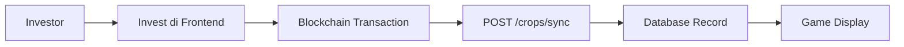
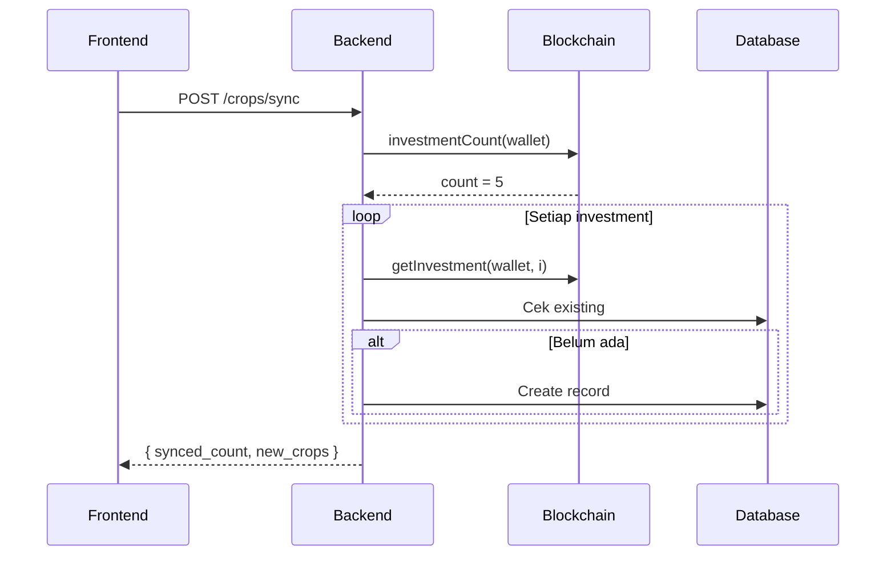

# Investor Crops API

API untuk manajemen investasi (crops) dari investor. Investasi disinkronisasi dari blockchain Mantle Network dan ditampilkan sebagai "tanaman" di game.

---

## Overview



---

## Endpoints

| Method | Endpoint | Auth | Description |
|--------|----------|------|-------------|
| `POST` | `/crops/sync` | ✅ | Sync investments dari blockchain |
| `GET` | `/crops` | ✅ | List semua crops user |
| `GET` | `/crops/:id` | ✅ | Detail satu crop |
| `POST` | `/crops/:id/water` | ✅ | Siram crop (game mechanic) |
| `POST` | `/crops/:id/harvest/sync` | ✅ | Sync status harvest |

> **Auth**: Semua endpoint memerlukan JWT token di header `Authorization: Bearer <token>`

---

## 1. Sync Investments

Sinkronisasi investasi dari blockchain ke database. Panggil setelah investor melakukan transaksi `invest()` di frontend.

| Method | Endpoint | Auth |
|--------|----------|------|
| `POST` | `/crops/sync` | ✅ |

### Request Body (Optional)

```json
{
  "tx_hash": "0x123..." // Optional: untuk tracking
}
```

### Response

```json
{
  "synced_count": 2,
  "new_crops": [
    {
      "id": "550e8400-e29b-41d4-a716-446655440000",
      "name": "Cabai Indofood",
      "image": "https://storage.ownafarm.com/crops/cabai.png",
      "cctv_image": "https://storage.ownafarm.com/cctv/farm1.jpg",
      "location": "Malang, Jawa Timur",
      "progress": 25,
      "days_left": 45,
      "yield_percent": 18.5,
      "invested": 1000.0,
      "status": "growing",
      "planted_at": "2026-01-10T10:00:00Z",
      "water_count": 0,
      "can_harvest": false
    }
  ]
}
```

### Sync Flow



---

## 2. List Crops

Mendapatkan daftar semua crops milik user dengan pagination.

| Method | Endpoint | Auth |
|--------|----------|------|
| `GET` | `/crops` | ✅ |

### Query Parameters

| Param | Type | Required | Description |
|-------|------|----------|-------------|
| `status` | string | ❌ | Filter: `growing`, `ready`, `harvested` |
| `page` | int | ❌ | Halaman (default: 1) |
| `limit` | int | ❌ | Items per page (default: 10, max: 100) |
| `sort_by` | string | ❌ | `invested_at`, `progress`, `status` |
| `sort_order` | string | ❌ | `asc`, `desc` (default: desc) |

### Response

```json
{
  "crops": [
    {
      "id": "550e8400-e29b-41d4-a716-446655440000",
      "name": "Cabai Indofood",
      "image": "https://storage.ownafarm.com/crops/cabai.png",
      "cctv_image": "https://storage.ownafarm.com/cctv/farm1.jpg",
      "location": "Malang, Jawa Timur",
      "progress": 75,
      "days_left": 15,
      "yield_percent": 18.5,
      "invested": 1000.0,
      "status": "growing",
      "planted_at": "2026-01-10T10:00:00Z",
      "water_count": 5,
      "can_harvest": false
    }
  ],
  "total_count": 10,
  "page": 1,
  "limit": 10
}
```

---

## 3. Get Crop Detail

Mendapatkan detail satu crop.

| Method | Endpoint | Auth |
|--------|----------|------|
| `GET` | `/crops/:id` | ✅ |

### Path Parameters

| Param | Type | Description |
|-------|------|-------------|
| `id` | UUID | Crop/Investment ID |

### Response

```json
{
  "id": "550e8400-e29b-41d4-a716-446655440000",
  "name": "Cabai Indofood",
  "image": "https://storage.ownafarm.com/crops/cabai.png",
  "cctv_image": "https://storage.ownafarm.com/cctv/farm1.jpg",
  "location": "Malang, Jawa Timur",
  "progress": 100,
  "days_left": 0,
  "yield_percent": 18.5,
  "invested": 1000.0,
  "status": "ready",
  "planted_at": "2026-01-10T10:00:00Z",
  "water_count": 10,
  "can_harvest": true
}
```

---

## 4. Water Crop

Menyiram tanaman (game mechanic untuk XP). Tidak mempengaruhi progress - hanya gimmick.

| Method | Endpoint | Auth |
|--------|----------|------|
| `POST` | `/crops/:id/water` | ✅ |

### Path Parameters

| Param | Type | Description |
|-------|------|-------------|
| `id` | UUID | Crop/Investment ID |

### Response

```json
{
  "crop": {
    "id": "550e8400-e29b-41d4-a716-446655440000",
    "name": "Cabai Indofood",
    ...
    "water_count": 6
  },
  "xp_gained": 5,
  "water_remaining": 90
}
```

### Watering Mechanic

- Setiap water menggunakan **10 water points**
- User mendapat **5 XP** per water
- Water points regenerasi secara otomatis

---

## 5. Sync Harvest

Sinkronisasi status harvest dari blockchain setelah user melakukan `harvest()` di frontend.

| Method | Endpoint | Auth |
|--------|----------|------|
| `POST` | `/crops/:id/harvest/sync` | ✅ |

### Path Parameters

| Param | Type | Description |
|-------|------|-------------|
| `id` | UUID | Crop/Investment ID |

### Response (After Harvest)

```json
{
  "id": "550e8400-e29b-41d4-a716-446655440000",
  "name": "Cabai Indofood",
  ...
  "status": "harvested",
  "can_harvest": false,
  "harvest_amount": 1185.0
}
```

---

## Crop Status

| Status | Description | can_harvest |
|--------|-------------|-------------|
| `growing` | Tanaman sedang bertumbuh | `false` |
| `ready` | Siap dipanen (maturity tercapai) | `true` |
| `harvested` | Sudah dipanen | `false` |

---

## Progress Calculation

Progress dihitung berdasarkan waktu:

```
progress = (now - invested_at) / duration_days * 100
```

- Progress **0-99%**: Status `growing`
- Progress **100%**: Status `ready`

---

## Error Responses

| Status | Message | Penyebab |
|--------|---------|----------|
| `401` | `User not authenticated` | Token tidak valid |
| `401` | `Wallet address not found` | Data wallet tidak ada di token |
| `404` | `Crop not found` | ID crop tidak ditemukan |
| `400` | `Not enough water points` | Water points tidak cukup |
| `400` | `Crop already harvested` | Crop sudah dipanen |
| `500` | Internal error | Kesalahan server |

---

## Frontend Implementation Notes

### Setelah Invest di Blockchain

```javascript
// 1. Panggil invest() di smart contract
const tx = await contract.invest(tokenId, amount);
await tx.wait();

// 2. Sync ke backend
await fetch('/crops/sync', {
  method: 'POST',
  headers: { 
    'Authorization': `Bearer ${token}`,
    'Content-Type': 'application/json'
  },
  body: JSON.stringify({ tx_hash: tx.hash })
});
```

### Setelah Harvest di Blockchain

```javascript
// 1. Panggil harvest() di smart contract
const tx = await contract.harvest(investmentId);
await tx.wait();

// 2. Sync status ke backend
await fetch(`/crops/${cropId}/harvest/sync`, {
  method: 'POST',
  headers: { 'Authorization': `Bearer ${token}` }
});
```

---

## Related Smart Contract Functions

```solidity
// OwnaFarmNFT.sol
function invest(uint256 tokenId, uint128 amount) external;
function harvest(uint256 investmentId) external;
function getInvestment(address investor, uint256 id) external view returns (Investment);
function investmentCount(address investor) external view returns (uint256);
```
