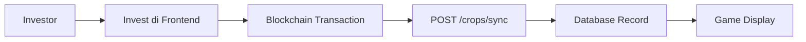
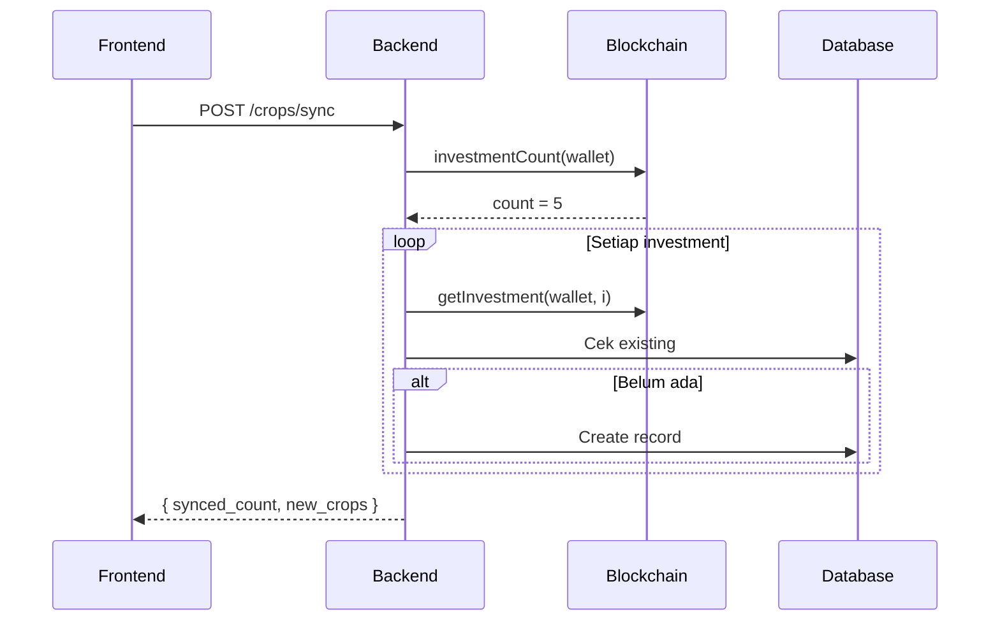

# Investor Crops API

API untuk manajemen investasi (crops) dari investor. Investasi disinkronisasi dari blockchain Mantle Network dan ditampilkan sebagai "tanaman" di game.

---

## Overview



---

## Endpoints

| Method | Endpoint | Auth | Description |
|--------|----------|------|-------------|
| `GET` | `/users/:id` | ✅ | Get user profile & game stats |
| `GET` | `/marketplace/invoices` | ✅ | Browse available invoices for investment |
| `POST` | `/crops/sync` | ✅ | Sync investments dari blockchain |
| `GET` | `/crops` | ✅ | List semua crops user |
| `GET` | `/crops/:id` | ✅ | Detail satu crop |
| `POST` | `/crops/:id/water` | ✅ | Siram crop (game mechanic) |
| `POST` | `/crops/:id/harvest/sync` | ✅ | Sync status harvest |
| `GET` | `/leaderboard` | ✅ | Get investor leaderboard |

> **Auth**: Semua endpoint memerlukan JWT token di header `Authorization: Bearer <token>`

---

## 1. Get User Profile

Mendapatkan profil user termasuk game stats (level, XP, water points). **Water points akan di-regenerate otomatis** saat endpoint ini dipanggil.

| Method | Endpoint | Auth |
|--------|----------|------|
| `GET` | `/users/:id` | ✅ |

### Path Parameters

| Param | Type | Description |
|-------|------|-------------|
| `id` | UUID | User ID (dari JWT token) |

### Response

```json
{
  "status": "success",
  "data": {
    "id": "550e8400-e29b-41d4-a716-446655440000",
    "wallet_address": "0x742d35Cc6634C0532925a3b844BC9e7595f7CCCC",
    "name": "Budi Investor",
    "email": "budi@example.com",
    "avatar": "avatar_1",
    "level": 3,
    "xp": 215,
    "water_points": 87,
    "last_regen_at": "2026-01-14T10:30:00Z",
    "last_login_at": "2026-01-14T12:00:00Z",
    "created_at": "2026-01-01T00:00:00Z",
    "updated_at": "2026-01-14T12:05:00Z"
  }
}
```

### Water Regeneration Logic

- Endpoint ini akan menghitung waktu sejak `last_regen_at`
- Menambahkan water berdasarkan rumus: `water_added = floor(elapsed_minutes / 5)`
- Update `water_points` (max 100) dan `last_regen_at`
- Contoh: Jika 25 menit berlalu, user dapat +5 water points

### Level Calculation

Level dihitung otomatis dari total XP:

| Level | XP Required | Level | XP Required |
|-------|-------------|-------|-------------|
| 1 | 0 | 6 | 1,800 |
| 2 | 50 | 7 | 2,450 |
| 3 | 200 | 8 | 3,200 |
| 4 | 450 | 9 | 4,050 |
| 5 | 800 | 10 | 5,000 |

---

## 2. Browse Marketplace Invoices

Mendapatkan list invoice (farm) yang tersedia untuk diinvest. Menampilkan invoice yang sudah **approved** oleh admin dan **belum fully funded**. Investor dapat melihat detail farm, farmer, dan progress funding sebelum melakukan investasi.

| Method | Endpoint | Auth |
|--------|----------|------|
| `GET` | `/marketplace/invoices` | ✅ |

### Query Parameters

| Param | Type | Required | Description |
|-------|------|----------|-------------|
| `min_price` | float | ❌ | Min target fund (GOLD) |
| `max_price` | float | ❌ | Max target fund (GOLD) |
| `min_yield` | float | ❌ | Min yield percent (0-100) |
| `max_yield` | float | ❌ | Max yield percent (0-100) |
| `min_duration` | int | ❌ | Min duration days |
| `max_duration` | int | ❌ | Max duration days |
| `min_land_area` | float | ❌ | Min farm land area (hectare) |
| `max_land_area` | float | ❌ | Max farm land area (hectare) |
| `location` | string | ❌ | Search in farm location (case-insensitive) |
| `crop_type` | string | ❌ | Search in invoice name (case-insensitive) |
| `page` | int | ❌ | Page number (default: 1, min: 1) |
| `limit` | int | ❌ | Items per page (default: 10, min: 1, max: 100) |
| `sort_by` | string | ❌ | Sort field: `created_at`, `name`, `target_fund`, `yield_percent`, `duration_days` |
| `sort_order` | string | ❌ | Sort order: `asc`, `desc` (default: `desc`) |

### Response

```json
{
  "status": "success",
  "data": {
    "invoices": [
      {
        "id": "550e8400-e29b-41d4-a716-446655440000",
        "token_id": 12345,
        "name": "Padi Organik Premium",
        "description": "Penanaman padi organik berkualitas tinggi dengan sistem irigasi modern",
        "image_url": "https://storage.example.com/invoices/rice-organic.jpg",
        "target_fund": "5000.00000000",
        "total_funded": "1250.00000000",
        "funding_progress": 25.0,
        "yield_percent": "18.50",
        "duration_days": 120,
        "maturity_date": "2026-05-14T00:00:00Z",
        
        "farm_id": "f1a2b3c4-d5e6-7890-abcd-ef1234567890",
        "farm_name": "Kebun Makmur Sejahtera",
        "farm_location": "Bogor, Jawa Barat",
        "farm_land_area": "2.50000000",
        "farm_cctv_image": "https://storage.example.com/farms/cctv-snapshot.jpg",
        
        "farmer_name": "Budi Santoso",
        
        "created_at": "2026-01-10T08:00:00Z",
        "approved_at": "2026-01-12T10:30:00Z"
      }
    ],
    "pagination": {
      "page": 1,
      "limit": 10,
      "total_items": 42,
      "total_pages": 5
    }
  }
}
```

### Example Requests

```bash
# List all available invoices (default: highest yield first)
GET /marketplace/invoices

# Filter by high yield opportunities
GET /marketplace/invoices?min_yield=15&sort_by=yield_percent&sort_order=desc

# Filter by price range and location
GET /marketplace/invoices?min_price=1000&max_price=5000&location=bogor

# Search for specific crop type
GET /marketplace/invoices?crop_type=padi

# Short-term investments only
GET /marketplace/invoices?max_duration=60&sort_by=duration_days&sort_order=asc

# Filter by farm size
GET /marketplace/invoices?min_land_area=1.5&max_land_area=5

# Pagination
GET /marketplace/invoices?page=2&limit=20
```

### Field Descriptions

- **`funding_progress`**: Calculated percentage (total_funded / target_fund × 100)
- **`yield_percent`**: Expected return percentage (e.g., 18.50% return)
- **`duration_days`**: Days until maturity (harvest time)
- **`maturity_date`**: Estimated harvest date
- **`farm_cctv_image`**: Latest CCTV snapshot from farm monitoring
- **`farm_land_area`**: Total land area in hectares

### Sort Options

Default sorting: **`yield_percent DESC`** (highest yield first)

Available sort fields:
- `created_at` - Newest/oldest invoices
- `name` - Alphabetical by crop name
- `target_fund` - By funding amount
- `yield_percent` - By expected return (recommended for investors)
- `duration_days` - By investment duration

### Integration Flow

```javascript
// 1. Browse marketplace
const response = await fetch('/marketplace/invoices?min_yield=15&limit=20', {
  headers: { 'Authorization': `Bearer ${token}` }
});
const { invoices } = response.data;

// 2. Display invoices to investor
invoices.forEach(invoice => {
  console.log(`${invoice.name} - ${invoice.yield_percent}% yield`);
  console.log(`Progress: ${invoice.funding_progress}%`);
  console.log(`Farm: ${invoice.farm_name} (${invoice.farm_location})`);
});

// 3. Investor selects invoice and invests via blockchain
// (See section "Setelah Invest di Blockchain" below)
```

---

## 3. Sync Investments

Sinkronisasi investasi dari blockchain ke database. Panggil setelah investor melakukan transaksi `invest()` di frontend.

| Method | Endpoint | Auth |
|--------|----------|------|
| `POST` | `/crops/sync` | ✅ |

### Request Body (Optional)

```json
{
  "tx_hash": "0x123..." // Optional: untuk tracking
}
```

### Response

```json
{
  "synced_count": 2,
  "new_crops": [
    {
      "id": "550e8400-e29b-41d4-a716-446655440000",
      "name": "Cabai Indofood",
      "image": "https://storage.ownafarm.com/crops/cabai.png",
      "cctv_image": "https://storage.ownafarm.com/cctv/farm1.jpg",
      "location": "Malang, Jawa Timur",
      "progress": 25,
      "days_left": 45,
      "yield_percent": 18.5,
      "invested": 1000.0,
      "status": "growing",
      "planted_at": "2026-01-10T10:00:00Z",
      "water_count": 0,
      "can_harvest": false
    }
  ]
}
```

### Sync Flow



---

## 4. List Crops

Mendapatkan daftar semua crops milik user dengan pagination.

| Method | Endpoint | Auth |
|--------|----------|------|
| `GET` | `/crops` | ✅ |

### Query Parameters

| Param | Type | Required | Description |
|-------|------|----------|-------------|
| `status` | string | ❌ | Filter: `growing`, `ready`, `harvested` |
| `page` | int | ❌ | Halaman (default: 1) |
| `limit` | int | ❌ | Items per page (default: 10, max: 100) |
| `sort_by` | string | ❌ | `invested_at`, `progress`, `status` |
| `sort_order` | string | ❌ | `asc`, `desc` (default: desc) |

### Response

```json
{
  "crops": [
    {
      "id": "550e8400-e29b-41d4-a716-446655440000",
      "name": "Cabai Indofood",
      "image": "https://storage.ownafarm.com/crops/cabai.png",
      "cctv_image": "https://storage.ownafarm.com/cctv/farm1.jpg",
      "location": "Malang, Jawa Timur",
      "progress": 75,
      "days_left": 15,
      "yield_percent": 18.5,
      "invested": 1000.0,
      "status": "growing",
      "planted_at": "2026-01-10T10:00:00Z",
      "water_count": 5,
      "can_harvest": false
    }
  ],
  "total_count": 10,
  "page": 1,
  "limit": 10
}
```

---

## 5. Get Crop Detail

Mendapatkan detail satu crop.

| Method | Endpoint | Auth |
|--------|----------|------|
| `GET` | `/crops/:id` | ✅ |

### Path Parameters

| Param | Type | Description |
|-------|------|-------------|
| `id` | UUID | Crop/Investment ID |

### Response

```json
{
  "id": "550e8400-e29b-41d4-a716-446655440000",
  "name": "Cabai Indofood",
  "image": "https://storage.ownafarm.com/crops/cabai.png",
  "cctv_image": "https://storage.ownafarm.com/cctv/farm1.jpg",
  "location": "Malang, Jawa Timur",
  "progress": 100,
  "days_left": 0,
  "yield_percent": 18.5,
  "invested": 1000.0,
  "status": "ready",
  "planted_at": "2026-01-10T10:00:00Z",
  "water_count": 10,
  "can_harvest": true
}
```

---

## 6. Water Crop

Menyiram tanaman (game mechanic untuk XP). Tidak mempengaruhi progress - hanya gimmick.

| Method | Endpoint | Auth |
|--------|----------|------|
| `POST` | `/crops/:id/water` | ✅ |

### Path Parameters

| Param | Type | Description |
|-------|------|-------------|
| `id` | UUID | Crop/Investment ID |

### Response

```json
{
  "crop": {
    "id": "550e8400-e29b-41d4-a716-446655440000",
    "name": "Cabai Indofood",
    ...
    "water_count": 6
  },
  "xp_gained": 5,
  "water_remaining": 90
}
```

### Watering Mechanic

- Setiap water menggunakan **10 water points**
- User mendapat **5 XP** per water
- **Water Regeneration:**
  - Regenerasi otomatis **1 water point per 5 menit** (12 per jam)
  - Maximum **100 water points**
  - Full recovery dalam ~8 jam jika habis total
  - Regenerasi terjadi saat GET `/users/:id` atau sebelum watering
- **Level System:**
  - Level naik otomatis berdasarkan total XP
  - Formula: `level = 1 + floor(sqrt(xp/50))`
  - Level 2 = 50 XP, Level 3 = 200 XP, Level 4 = 450 XP, dst
- **Concurrency Protection:**
  - Jika 2+ water request simultan, sistem mencegah water negatif
  - Akan return error `Not enough water points` jika race condition

---

## 7. Sync Harvest

Sinkronisasi status harvest dari blockchain setelah user melakukan `harvest()` di frontend.

| Method | Endpoint | Auth |
|--------|----------|------|
| `POST` | `/crops/:id/harvest/sync` | ✅ |

### Path Parameters

| Param | Type | Description |
|-------|------|-------------|
| `id` | UUID | Crop/Investment ID |

### Response (After Harvest)

```json
{
  "crop": {
    "id": "550e8400-e29b-41d4-a716-446655440000",
    "name": "Cabai Indofood",
    "image": "https://storage.ownafarm.com/crops/cabai.png",
    "cctv_image": "https://storage.ownafarm.com/cctv/farm1.jpg",
    "location": "Malang, Jawa Timur",
    "progress": 100,
    "days_left": 0,
    "yield_percent": 18.5,
    "invested": 1000.0,
    "status": "harvested",
    "planted_at": "2026-01-10T10:00:00Z",
    "water_count": 10,
    "can_harvest": false,
    "harvest_amount": 1185.0
  },
  "xp_gained": 50
}
```

### XP Mechanic

- User mendapat **50 XP** per harvest
- XP hanya diberikan **sekali** saat harvest pertama kali di-sync
- Jika crop sudah berstatus `harvested`, `xp_gained` akan bernilai `0`

---

## Crop Status

| Status | Description | can_harvest |
|--------|-------------|-------------|
| `growing` | Tanaman sedang bertumbuh | `false` |
| `ready` | Siap dipanen (maturity tercapai) | `true` |
| `harvested` | Sudah dipanen | `false` |

---

## Progress Calculation

Progress dihitung berdasarkan waktu:

```
progress = (now - invested_at) / duration_days * 100
```

- Progress **0-99%**: Status `growing`
- Progress **100%**: Status `ready`

---

## 8. Get Leaderboard

Mendapatkan leaderboard investor berdasarkan XP, kekayaan (total investment), atau profit.

| Method | Endpoint | Auth |
|--------|----------|------|
| `GET` | `/leaderboard` | ✅ |

### Query Parameters

| Param | Type | Required | Description |
|-------|------|----------|-------------|
| `type` | string | ✅ | Tipe leaderboard: `xp`, `wealth`, `profit` |
| `limit` | int | ❌ | Jumlah user (default: 10, max: 100) |

### Response

```json
{
  "type": "xp",
  "entries": [
    {
      "rank": 1,
      "wallet_address": "0x742d35Cc6634C0532925a3b844BC9e7595f7CCCC",
      "score": 2500,
      "is_current_user": false
    },
    {
      "rank": 2,
      "wallet_address": "0x8ba1f109551bD432803012645Ac136ddd64DBA72",
      "score": 1800,
      "is_current_user": true
    }
  ],
  "user_entry": null
}
```

### User Entry

Jika user saat ini **tidak masuk top-N**, field `user_entry` akan berisi posisi user:

```json
{
  "type": "xp",
  "entries": [...],
  "user_entry": {
    "rank": 42,
    "wallet_address": "0x...",
    "score": 215,
    "is_current_user": true
  }
}
```

### Leaderboard Types

| Type | Score Calculation |
|------|-------------------|
| `xp` | Total XP user dari game mechanics (watering, harvesting) |
| `wealth` | Total jumlah investasi (sum of `amount`) |
| `profit` | Total profit dari crops yang sudah di-harvest (`harvest_amount - amount`) |

### Caching

- Leaderboard di-cache selama **5 menit** untuk performa
- Posisi user saat ini (`user_entry`) selalu fresh (tidak di-cache)

### Example Requests

```bash
# Get XP leaderboard (top 10)
GET /leaderboard?type=xp

# Get Wealth leaderboard (top 50)
GET /leaderboard?type=wealth&limit=50

# Get Profit leaderboard
GET /leaderboard?type=profit&limit=20
```

---

## Error Responses

| Status | Message | Penyebab |
|--------|---------|----------|
| `401` | `User not authenticated` | Token tidak valid |
| `401` | `Wallet address not found` | Data wallet tidak ada di token |
| `404` | `Crop not found` | ID crop tidak ditemukan |
| `400` | `Not enough water points` | Water points tidak cukup |
| `400` | `Crop already harvested` | Crop sudah dipanen |
| `500` | Internal error | Kesalahan server |

---

## Frontend Implementation Notes

### Setelah Invest di Blockchain

```javascript
// 1. Panggil invest() di smart contract
const tx = await contract.invest(tokenId, amount);
await tx.wait();

// 2. Sync ke backend
await fetch('/crops/sync', {
  method: 'POST',
  headers: { 
    'Authorization': `Bearer ${token}`,
    'Content-Type': 'application/json'
  },
  body: JSON.stringify({ tx_hash: tx.hash })
});
```

### Setelah Harvest di Blockchain

```javascript
// 1. Panggil harvest() di smart contract
const tx = await contract.harvest(investmentId);
await tx.wait();

// 2. Sync status ke backend
await fetch(`/crops/${cropId}/harvest/sync`, {
  method: 'POST',
  headers: { 'Authorization': `Bearer ${token}` }
});
```

---

## Related Smart Contract Functions

```solidity
// OwnaFarmNFT.sol
function invest(uint256 tokenId, uint128 amount) external;
function harvest(uint256 investmentId) external;
function getInvestment(address investor, uint256 id) external view returns (Investment);
function investmentCount(address investor) external view returns (uint256);
```
